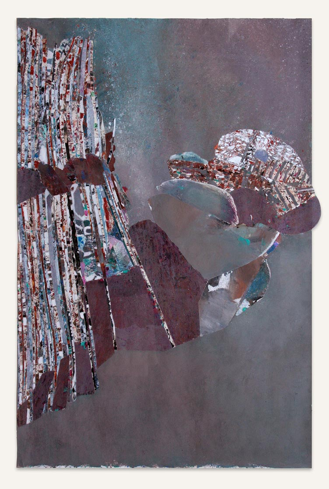
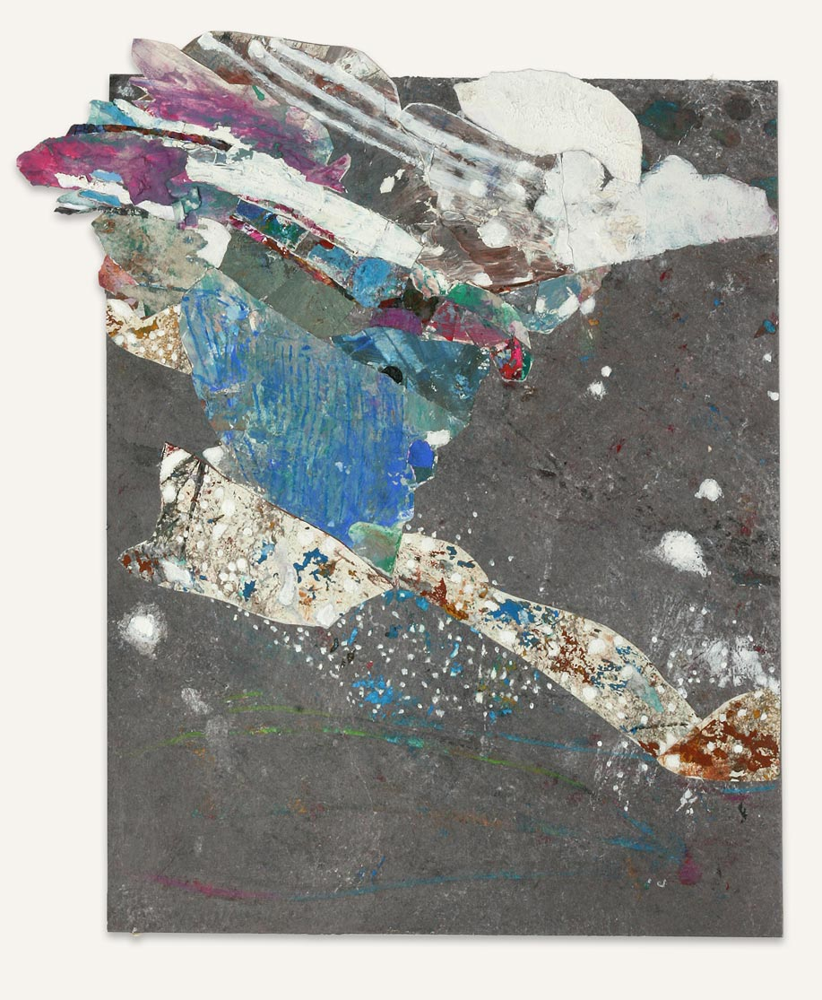
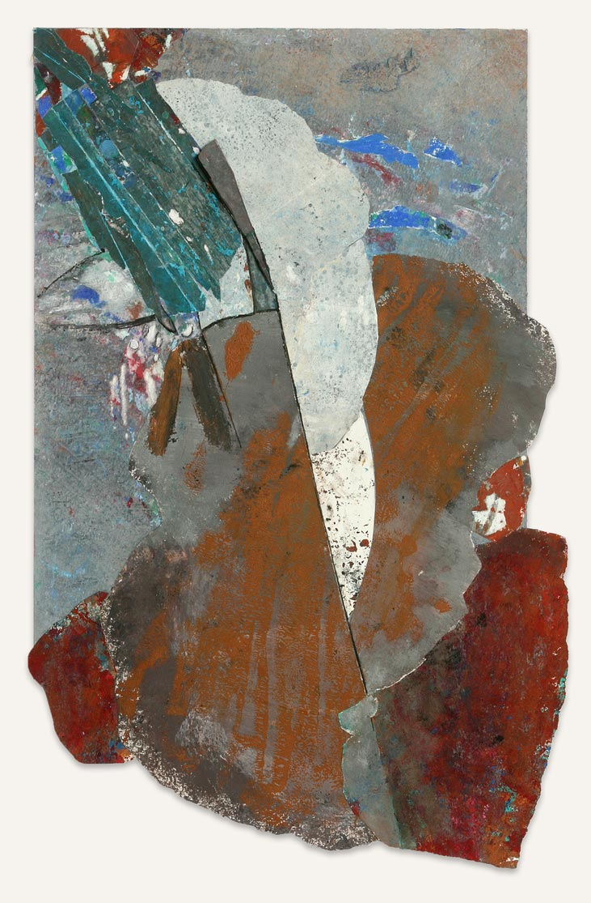
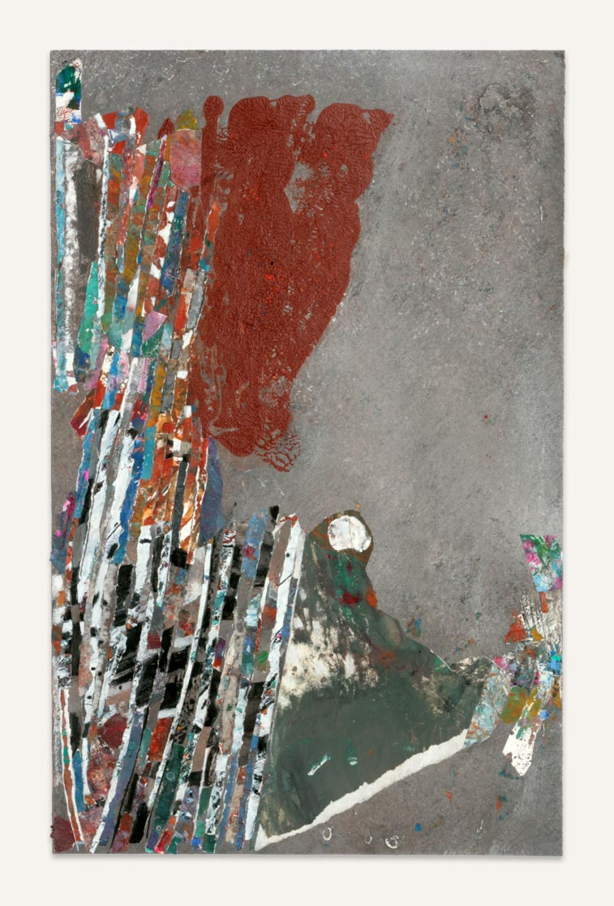
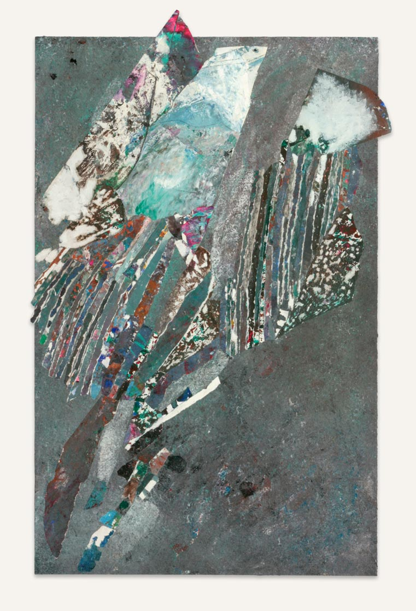
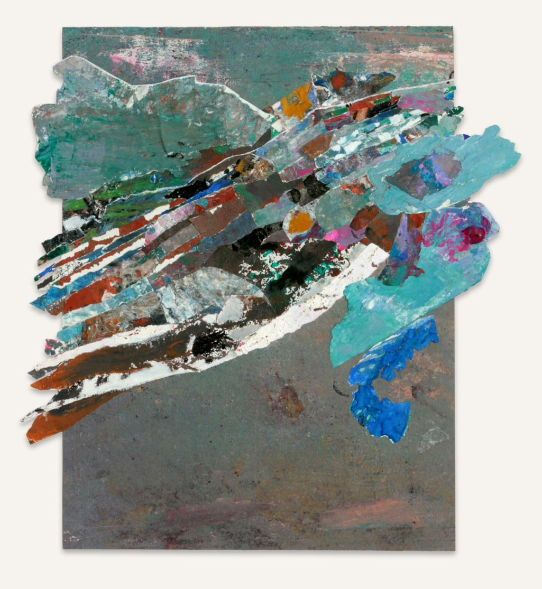
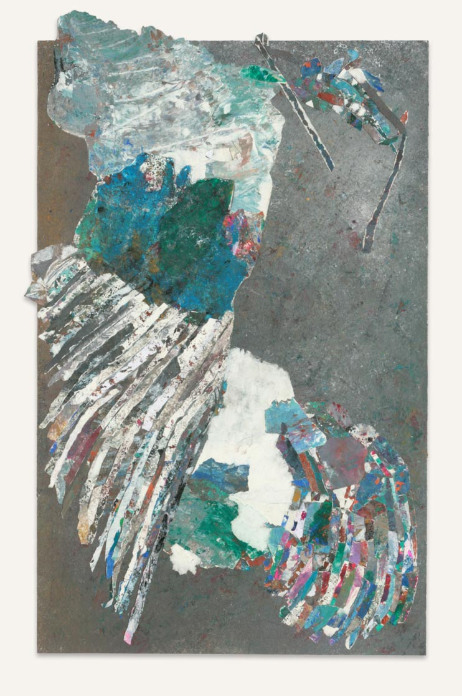
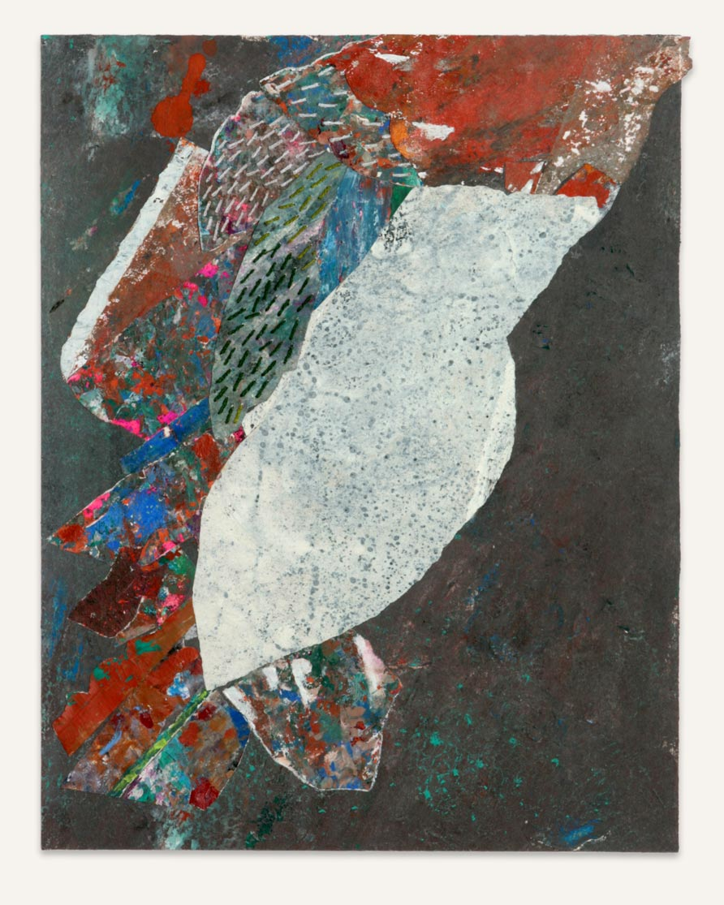
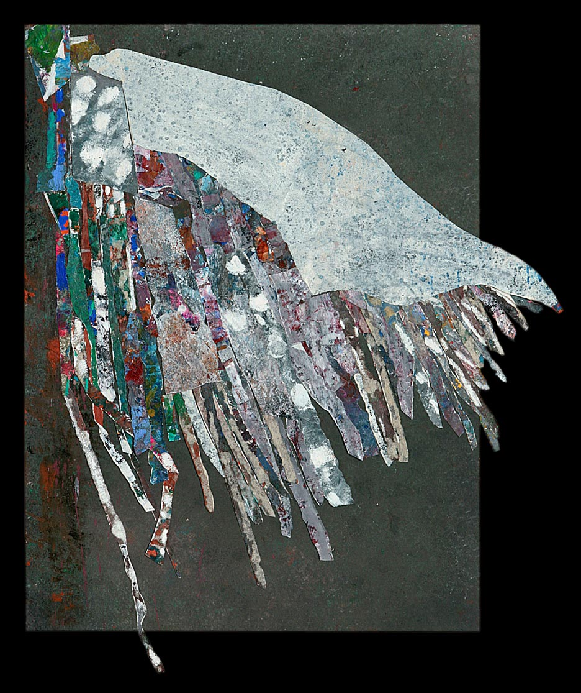



    <nav class="float-sidenav__nav">
      <button class="reset float-sidenav__close-btn js-float-sidenav__close-btn js-tab-focus" aria-label="Close page navigation">
        <svg class="icon" viewBox="0 0 16 16"><g stroke-width="1" stroke="currentColor" fill="none" stroke-linecap="round" stroke-linejoin="round" stroke-miterlimit="10"><line x1="13.5" y1="2.5" x2="2.5" y2="13.5"></line><line x1="2.5" y1="2.5" x2="13.5" y2="13.5"></line></g></svg>
      </button>
      <ul class="float-sidenav__list js-float-sidenav__list">
        <li class="float-sidenav__item">
          <a href="#peinture-1" class="float-sidenav__link js-smooth-scroll">
            Peinture 1
            
          </a>
        </li>
        <li class="float-sidenav__item">
          <a href="#peinture-2" class="float-sidenav__link js-smooth-scroll">
            Peinture 2
            
          </a>
        </li>
        <li class="float-sidenav__item">
          <a href="#peinture-3" class="float-sidenav__link js-smooth-scroll">
            Peinture 3
            
          </a>
        </li>
        <li class="float-sidenav__item">
          <a href="#peinture-4" class="float-sidenav__link js-smooth-scroll">
            Peinture 4
            
          </a>
        </li>
        <li class="float-sidenav__item">
          <a href="#peinture-5" class="float-sidenav__link js-smooth-scroll">
            Peinture 5
            
          </a>
        </li>
        <li class="float-sidenav__item">
          <a href="#peinture-6" class="float-sidenav__link js-smooth-scroll">
            Peinture 6
            
          </a>
        </li>
        <li class="float-sidenav__item">
          <a href="#peinture-7" class="float-sidenav__link js-smooth-scroll">
            Peinture 7
            
          </a>
        </li>
        <li class="float-sidenav__item">
          <a href="#peinture-8" class="float-sidenav__link js-smooth-scroll">
            Peinture 8
            
          </a>
        </li>
        <li class="float-sidenav__item">
          <a href="#peinture-9" class="float-sidenav__link js-smooth-scroll">
            Peinture 9
            
          </a>
        </li>
        <li class="float-sidenav__item">
          <a href="#peinture-10" class="float-sidenav__link js-smooth-scroll">
            Peinture 10
            
          </a>
        </li>
      </ul>
    </nav>

<!-- <button class="btn btn--subtle margin-bottom-md hide@md" aria-controls="float-sidenav-1">Show Page Navigation</button> -->
<ul class="parent js-float-sidenav-target">
    <li id="peinture-1" class="child">
      
    </li>
    <li id="peinture-2" class="child">
      
    </li>
    <li id="peinture-3" class="child">
      
    </li>
    <li id="peinture-4" class="child">
      
    </li>
    <li id="peinture-5" class="child">
      
    </li>
    <li id="peinture-6" class="child">
      
    </li>
    <li id="peinture-7" class="child">
      
    </li>
    <li id="peinture-8" class="child">
      
    </li>
    <li id="peinture-9" class="child">
      
    </li>
    <li id="peinture-10" class="child">
      
    </li>
</ul>
<h3 class="gallery__title-block" aria-controls="modal-full-width">
galerie : 
À vol d'oiseaux
<button class="gallery__title-trigger">
  <svg class="icon" viewBox="0 0 20 20">
    <title>Ouvrir la fenêtre</title>
    <g fill="none" stroke="currentColor" stroke-miterlimit="10" stroke-width="1" stroke-linecap="round" stroke-linejoin="round">
      <line x1="3" y1="3" x2="15" y2="15" />
      <line x1="15" y1="3" x2="3" y2="15" />
    </g>
  </svg>
</button>
</h3>

  

    <header class="padding-y-sm padding-x-md flex items-center justify-between">
      <h3 class="gallery__title" id="modal-title">À vol d'oiseaux</h3>
      <button class="reset modal__close-btn modal__close-btn--inner js-modal__close js-tab-focus">
        <svg class="icon" viewBox="0 0 20 20">
          <title>Fermer la fenêtre</title>
          <g fill="none" stroke="currentColor" stroke-miterlimit="10" stroke-width="2" stroke-linecap="round" stroke-linejoin="round">
            <line x1="3" y1="3" x2="17" y2="17" />
            <line x1="17" y1="3" x2="3" y2="17" />
          </g>
        </svg>
      </button>
    </header>
    <article class="padding-y-sm padding-x-md flex-grow overflow-auto">
      

        
Lorem ipsum dolor sit amet consectetur adipisicing elit. Vitae culpa, inventore alias ab atque similique quod ea reprehenderit.

        
Planas de Font

      

    </article>
  

 

